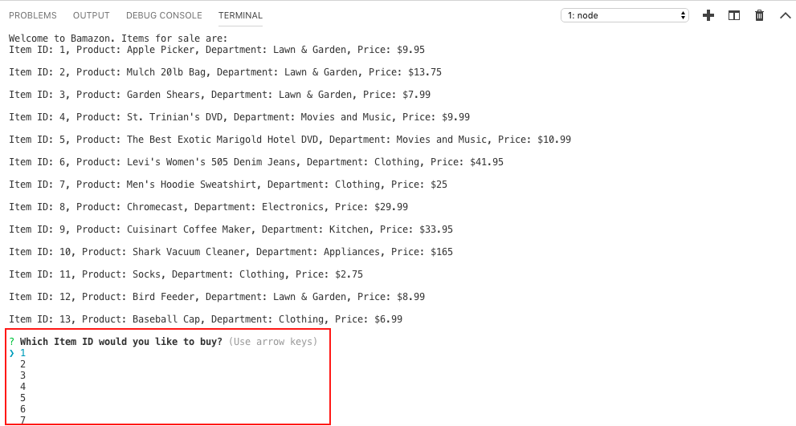
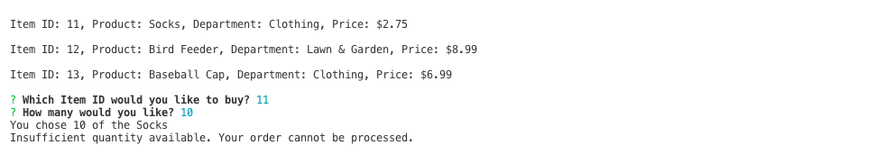
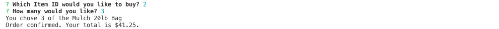
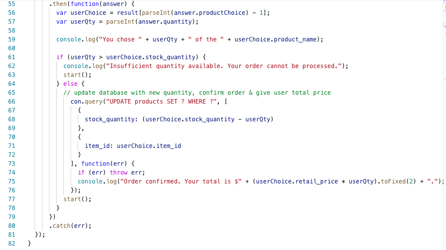
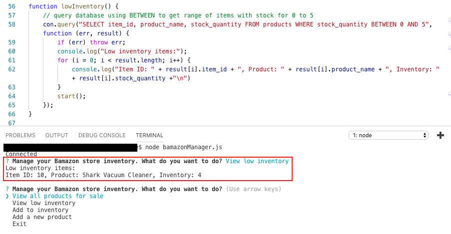
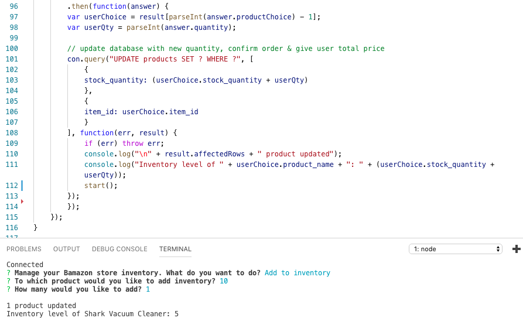
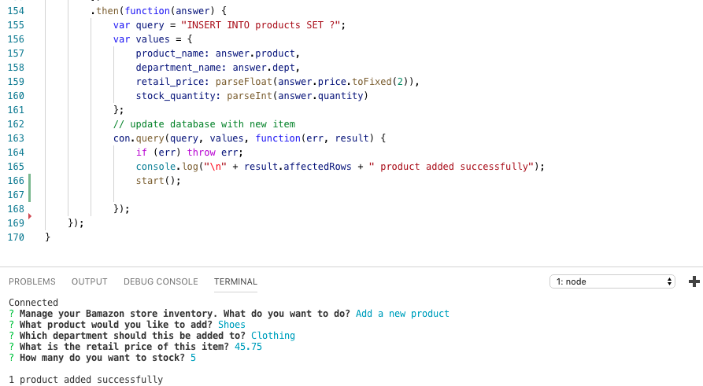

# Bamazon Store: A Node.js CLI App with MySQL
This app uses a MySQL database of items for sale. The customer version allows users to select items from the store to buy. If there is adequate inventory for the order, the "sale" will go through and update the remaining quantity of the item in stock. The manager version allows the user to view all items, view low inventory items with stock quantities of 5 or less, add inventory to an existing item, or add a new item to the store. Packages required for this app are MySQL and Inquirer.

## Bamazon Customer
* First the bamazonCustomer.js file queries the database, loops through all results, and logs all items for sale to the console.
* Next, using Inquirer the app asks the user which item they want to buy.

* Then the user is asked how many of the item they want. A database query compares the number available to the number requested. 
* An if/else statement determine which message to display. If the requested quantity is greater than the stock quantity the user is notified their order can't be processed. 

* If it's less than or equal to the stock quantity the order is confirmed and the user is given a total cost.

* Once the order is confirmed the database is updated with new stock quantity.

## Bamazon Store Manager
The bamazonManager.js uses Inquirer to ask which function the manager wants to do and a switch statement to run the appropriate function.
* **View all products for sale** queries the database, loops through all results, and logs all items for sale to the console.
* **View low inventory** queries the database for items with inventory between 0 and 5, loops through the results and logs all low inventory items to the console.

* **Add to inventory** allows the user to increase stock quantity on an existing item. First inquirer is used to ask which item to add inventory to & how many to add. Then the database is updated wit the new quantity.

* **Add a new product** allows the user to add a comletely new item. Inquirer is used to ask details about the item to add. Then the database is updated using the response.

